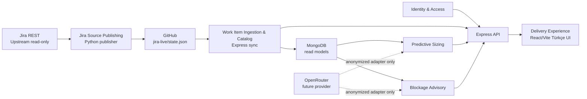

# Context Map

## Akış Diyagramı

## İlişkiler

| Upstream | Downstream | İlişki | Paylaşılan Şey | Kural |
| --- | --- | --- | --- | --- |
| Jira REST | Jira Source Publishing | Upstream/Supplier | Jira REST JSON | Publisher anti-corruption layer uygular. |
| Jira Source Publishing | GitHub State | Published Language | `state.json`, warnings, metadata | Jira write yok; payload değişmediyse publish atlanabilir. |
| GitHub State | Work Item Ingestion & Catalog | Anti-Corruption | Published state DTO | Backend Jira'ya direkt gitmez. |
| Work Item Ingestion & Catalog | Predictive Sizing | Customer/Supplier | Normalized `JiraIssue`, `JiraSprint`, field mappings | Sizing sadece read model ve IDs tüketir. |
| Work Item Ingestion & Catalog | Blockage Advisory | Customer/Supplier | Issue text/features, historical examples | Blockage Jira issue entity'si sahiplenmez. |
| Identity & Access | Express API | Guard | Session user, role claims | Domain context'ler auth token üretmez. |
| Predictive Sizing | Delivery Experience | API Contract | `SizingRecommendation` DTO | UI recommendation hesaplamaz. |
| Blockage Advisory | Delivery Experience | API Contract | `BlockageRecommendation` DTO | UI aksiyonları gösterir, Jira'ya yazmaz. |
| Admin UI | Identity & Access | API Contract | User commands/queries | User CRUD sadece admin role ile. |
| Admin UI | Blockage Advisory | API Contract | Blockage pattern commands/queries | Pattern ownership Blockage context'tedir. |
| OpenRouter Adapter | Predictive Sizing / Blockage Advisory | Future External Provider | Anonymized prompt/result DTO | Anonimleştirme olmadan dış çağrı yok. |

## Veri Akışı

1. Şirket PC publisher Jira field/sprint/issue verisini okur.
2. Publisher story point field mapping'i çözer, minimum veri uyarılarını ekler.
3. Publisher GitHub `jira-live/state.json` dosyasını günceller.
4. Backend startup ve interval job state'i poll eder.
5. Ingestion context normalize eder ve Mongo'ya upsert eder.
6. Kullanıcı UI'da login olur, backlog list/filter üzerinden issue seçer.
7. Sizing context historical issue neighbor set'i ile recommendation üretir.
8. Blockage context issue text veya input text için action/evidence üretir.
9. UI result, similar issues, rationale, warning ve confidence gösterir.

## Domain Events / Records

| Event/Record | Üreten | Tüketen | Not |
| --- | --- | --- | --- |
| `JiraStatePublished` | Jira Source Publishing | Work Item Ingestion & Catalog | GitHub state metadata olarak görülebilir. |
| `SyncRunStarted` | Work Item Ingestion & Catalog | Sync health UI | Mongo `sync_runs`. |
| `SyncRunCompleted` | Work Item Ingestion & Catalog | Sync health UI | Warning/error içerir. |
| `JiraIssueUpserted` | Work Item Ingestion & Catalog | Recommendation contexts | Event veya internal record olabilir. |
| `SizingRecommendationCreated` | Predictive Sizing | Delivery Experience, audit | Mongo `recommendations`. |
| `BlockageRecommendationCreated` | Blockage Advisory | Delivery Experience, audit | Mongo `recommendations`. |
| `BlockagePatternChanged` | Blockage Advisory | Admin UI | KB güncelleme izi. |
| `UserAuthenticated` | Identity & Access | Delivery Experience | Session state. |

## Boundary Kuralları

- Context'ler Mongo collection adlarını paylaşabilir, private entity davranışını paylaşamaz.
- API DTO'ları read/write boundary'dir; aggregate doğrudan serialize edilmez.
- Recommendation context'leri Jira raw JSON'a bağımlı kalmaz.
- UI dictionary domain language'ı değiştirmez; sadece çeviri/presentation katmanıdır.
- Future AI adapter domain interface'e uyar; provider-specific response domain'e sızmaz.
